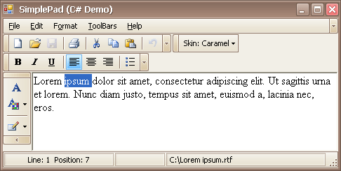

# Toolbars and Menus
This section describes the capabilities provided by toolbars and menus.

&nbsp;

**Layout Customization**
* [Open Toolbar Customization Window](toolbars-and-menus/layout-customization/open-toolbar-customization-window.md)
* [Finish Toolbar Customization](toolbars-and-menus/layout-customization/finish-toolbar-customization.md)
* [Hide and Display Toolbars](toolbars-and-menus/layout-customization/hide-and-display-toolbars.md)
* [Hide and Display Bar Commands](toolbars-and-menus/layout-customization/hide-and-display-bar-commands.md)
* [Rearrange Toolbars and Menus](toolbars-and-menus/layout-customization/rearrange-toolbars-and-menus.md)
* [Rearrange Bar Commands](toolbars-and-menus/layout-customization/rearrange-bar-commands.md)
* [Restore the Default Layout of Bar Commands](toolbars-and-menus/layout-customization/restore-the-default-layout-of-bar-commands.md)

&nbsp;

**Navigation**
* [Keyboard Navigation in Menus and Toolbars](toolbars-and-menus/navigation/keyboard-navigation-in-menus-and-toolbars.md)

&nbsp;

**Select Commands**
* [Invoke Toolbar and Menu Commands](toolbars-and-menus/select-commands/invoke-toolbar-and-menu-commands.md)