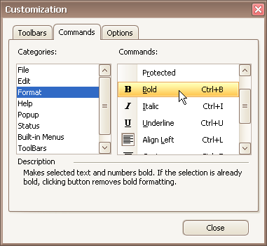
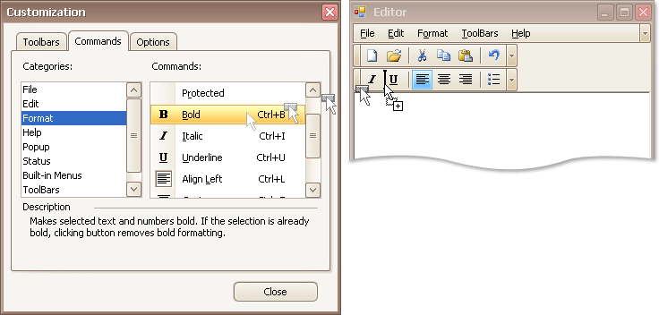
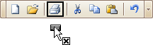

# Hide and Display Bar Commands
## Temporarily Hide and Display Bar Commands
You can temporarily hide bar commands, and then restore hidden commands within a specific bar as follows:
1. Click the dropdown button displayed at the right edge of the bar:
	
	
2. Select **Add or Remove Buttons**, and then select the name of the clicked bar displayed at the top of the submenu. A check list of bar commands displayed within the bar will be displayed:
	
	
3. To hide specific commands, uncheck corresponding items via mouse click. To display hidden commands, check the corresponding items.

If a specific command is not available in a bar's command list, you can still access this command in customization mode, and add this command to the bar. See below, to learn more.

## Hide and Display Bar Commands in Customization Mode
First, open the [Customization window](open-toolbar-customization-window.md).

To add a specific bar command to a bar, do the following:

1. Switch to the **Commands** tab page and locate the required command in the **Commands** list. Typically, commands are grouped into categories, so you can first select a category to quickly locate the command.
	
	
2. Drag the bar command from the **Commands** list onto a bar or menu. Note that you can put bar commands into nested menus. Menus will automatically open when you drag a bar command over their parent menu items.
	
	

To remove a bar command from a bar, drag the bar command away from the bar, and drop it when the mouse cursor changes its image to 'x':

> [!NOTE]
> You can cancel drag and drop while dragging an item by pressing ESC.