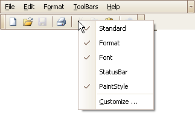
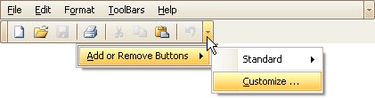
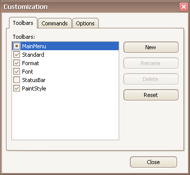

# Open Toolbar Customization Window
Opening the Customization window activates the customization mode where you can:
* Rearrange, hide and display bar commands.
* Change display options of bar commands.
* Hide bars, etc

To open the Customization window, do one of the following:
* Right-click any bar or the empty space, and select **Customize...**
	
	
* Click the dropdown button displayed at the right edge of any bar. Then select **Add or Remove Buttons** and then **Customize...**
	
	
* Double-click the empty space, not occupied by any bar.
	
	

The Customization window will be opened, containing three tabs:

The **Toolbars** tab allows you to hide specific bars and display hidden ones.

The **Commands** tab allows you to access bar commands and add them to bars.

The **Options** tab allows you to control options affecting the display of menus and bar commands.