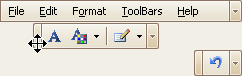
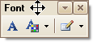
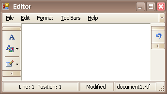
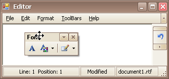

# Rearrange Toolbars and Menus
To move a bar docked to a form to a new position, drag it via its drag widget.

To move a floating bar, drag it by its caption.

To dock a bar to any of the four edges of the form, drag the bar to this edge.

To make a docked bar floating, drag the bar away from the form's edges.

