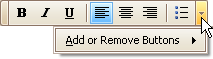
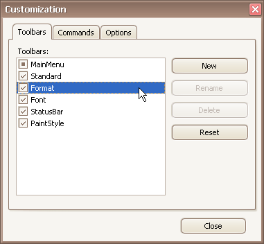
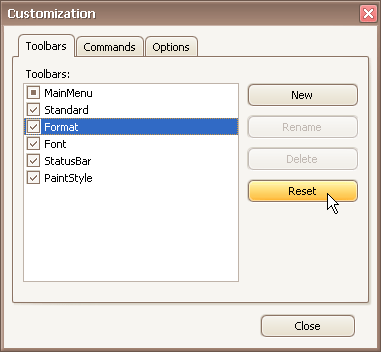

# Restore the Default Layout of Bar Commands
You can customize the layout of bar commands within a bar by hiding and rearranging them. Subsequently, you can revert to the default layout of bar commands. This topic describes two ways to do this.

## Restore the Default Layout Using Quick Customization
1. Click the dropdown button displayed at the right edge of any bar:
	
	
2. Select **Add or Remove Buttons**, and then select the name of the clicked bar displayed at the top of the submenu. Then, select **Reset Toolbar**.
	
	

## Restore the Default Layout in Customization Mode
1. Open the [Customization window](open-toolbar-customization-window.md).
2. Select a bar in the list whose layout is to be restored.
	
	
3. Click **Reset**.
	
	