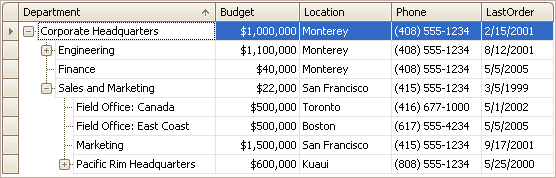

# Tree List
This section describes the capabilities provided by a multi-column tree view, which displays hierarchical data, supports data editing, sorting, summary calculation and many other features:

&nbsp;

**Data Editing**
* [Edit Cells in a Tree List](tree-list/edit-cells-in-a-tree-list.md)

&nbsp;

**Data Presentation**
* [Sort Tree List Nodes](tree-list/data-presentation/sort-tree-list-nodes.md)

&nbsp;

**Data Analysis**
* [Filter TreeList Data](tree-list/data-analysis/filter-treelist-data.md)
* [Show Summaries (Totals) in a Tree List](tree-list/data-analysis/show-summaries-(totals)-in-a-tree-list.md)
* [Apply Cell Conditional Formatting](tree-list/data-analysis/apply-cell-conditional-formatting.md)

&nbsp;

**Layout Customization**
* [Expand and Collapse Nodes in a Tree List](tree-list/layout-customization/expand-and-collapse-nodes-in-a-tree-list.md)
* [Hide and Display Tree List Columns](tree-list/layout-customization/hide-and-display-tree-list-columns.md)
* [Reorder Tree List Columns](tree-list/layout-customization/reorder-tree-list-columns.md)
* [Resize Tree List Columns](tree-list/layout-customization/resize-tree-list-columns.md)

&nbsp;

**Selection and Navigation**
* [Navigation in a Tree List](tree-list/selection-and-navigation/navigation-in-a-tree-list.md)
* [Select Tree List Nodes](tree-list/selection-and-navigation/select-tree-list-nodes.md)