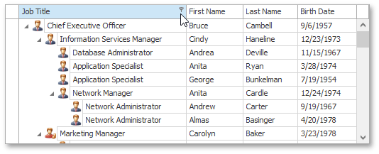
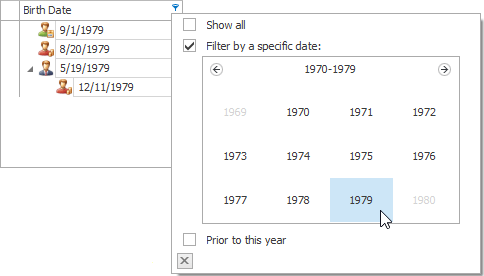
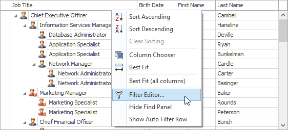
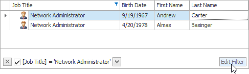
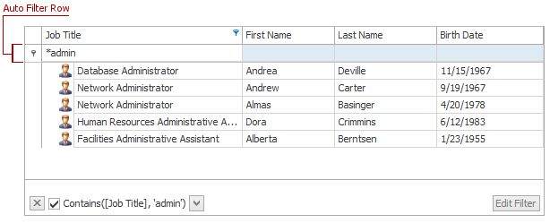
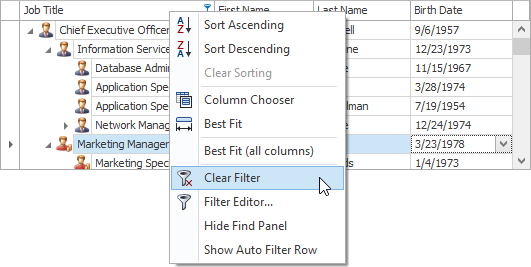
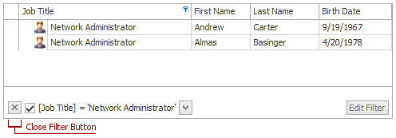
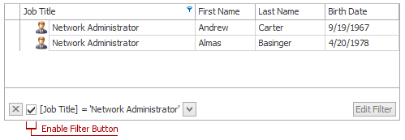

# Filter TreeList Data
## Invoking the Filter Dropdown List
Hover over the column header and click the filter button  that appears.

## Creating a Simple Filter Condition
To select records that contain a specific value in a specific column, do the following.
1. Invoke the filter dropdown list containing available filter values.
	
	By default, if filtering is applied, the filter dropdown will only display the values which match the current filter criteria. If the SHIFT key is pressed while opening the filter dropdown, all values will be listed (not only those that match the current filter criteria).
2. Select the required filter value in the filter dropdown list.
	
	
	
	The filter dropdown list will be immediately closed, and the control will display the records that contain the specified value in the specified column.
	
	If the filter dropdown list provides check boxes to the left of filter values, multiple values can be selected (checked) simultaneously.
	
	
	
	In this mode, click the **OK** button to close the filter dropdown list and apply the filter.
	
	For date-time columns, the filter dropdown list is displayed as a calendar. To apply the filter, select the desired date.
	
	
	
	The control will immediately display records which contain the selected date in the appropriate column. To hide the filter dropdown list, click the close button .

## Using the Advanced Filter Editor Dialog
To invoke an advanced Filter Editor dialog, do one of the following.
* Right-click any column's header and select **Filter Editor**.
	
	
* If the Filter Panel at the bottom of the TreeList control is visible, click the **Edit Filter** button.
	
	

To learn how to work with the Filter Editor, refer to [Filter Data via the Filter Editor](../../filter-editor/filter-data-via-the-filter-editor.md).

## Using the Auto Filter Row
If the Auto Filter Row is displayed at the top of the TreeList control, you can type text within this row. A filter condition is automatically created based on the entered value, and the filter is applied to the focused column.

## Clearing the Filter
To clear the filter applied to a specific column, do one of the following.
* Invoke the filter dropdown list (see above), and then choose between clicking (All) or selecting (Select All) or choosing (Show All,) depending on the dropdown list type.
* Right-click the column header and select the **Clear Filter** menu item. 
	
	

To clear all filter criteria, click the Close Filter Button within the Filter Panel.

## Disabling/Enabling the Filter
Click the Enable Filter Button within the Filter Panel.

