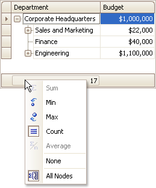

# Show Summaries (Totals) in a Tree List
To change the type of summary for a specific column or apply a summary, do the following:
1. Right-click a region within a group footer or grid footer under a specific column. A context menu displaying a list of supported summary types will be displayed.
	
	
2. Select the required option from the context menu.

To calculate summaries against all nodes, ensure that the **All Nodes** menu check item is checked. To calculate summaries against root nodes only, uncheck the **All Nodes** check item.