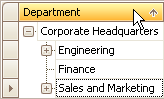
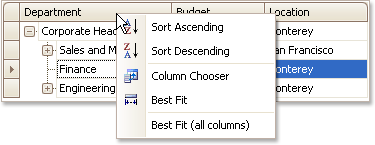

# Sort Tree List Nodes
To sort nodes by a column's values and replace existing sort conditions that are applied to the current or other columns, click the target column's header, until an Up or Down Arrow icon is displayed within the header. The Up and Down Arrows indicate ascending and descending sort orders respectively.

To sort nodes by a column's values while preserving existing sort conditions, do one of the following:
* Click a column header while holding the SHIFT key down, until an UP or Down Arrow icon is displayed within the header.
* Right-click a column header and select **Sort Ascending** or **Sort Descending** from the context menu that will appear.
	
	

To remove sorting by a column, click a column header while holding the CTRL key down.