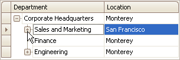

# Expand and Collapse Nodes in a Tree List
## Expand and Collapse Nodes
Do one of the following:
* Focus the node and then press PLUS on the keyboard to expand the node, and MINUS to collapse the node:
* Click the node's expand button.
	
	
* Double-click the indicator cell corresponding to the node.
	
	

## Expand Nodes Recursively
To expand a node and all its child nodes that have nested nodes, focus the node and press MULTIPLY on the keyboard.