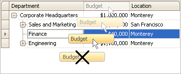
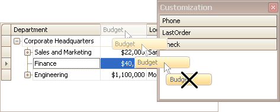
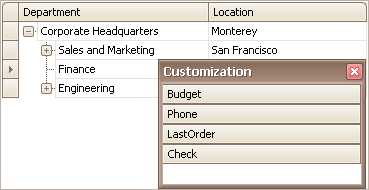
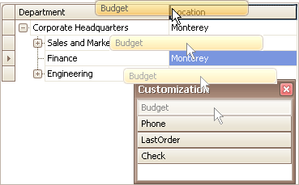

# Hide and Display Tree List Columns
## Hide Columns
Do one of the following:
* Click a column header and drag it outside the header panel, until the cursor changes its image to the big 'X'. Then drop the header.
	
	
* Drag and drop a column header onto the Customization Form if it's open (see below).
	
	

## Display Hidden Columns
1. Open the Customization Form by right-clicking a column header and selecting **Column Chooser**.
	
	
	
	The Customization Form will be displayed listing hidden columns (if any).
	
	
2. Drag the required column from the Customization Form onto the column header panel and drop it at the required position.
	
	