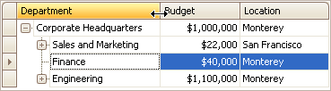

# Resize Tree List Columns
To resize columns, drag the right edge of the target column header:

To change a column's width so that it displays its contents compactly in their entirety, do one of the following:
* Double-click the right edge of the column header.
* Right-click the column's header and select **Best Fit**.
	
	

To change the widths of all columns so that they display their contents in the best possible way, right-click the header of any column and select **Best Fit (all columns)**.