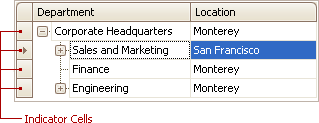

# Select Tree List Nodes
## Change Focused Node
To focus a node and clear the existing selection, do one of the following.
* Click the node's indicator cell or any of its data cells.
	
	
* Select the node using the ARROW keys.

## Select Multiple Nodes
To select a node while preserving the current selection, click the node's indicator cell or any of its data cells, while holding the CTRL key down.

To toggle the focused node's selected state, do one of the following.
* Press CTRL+SPACE.
* Click the node while holding the CTRL key down.

To move focus between nodes while preserving the current selection, use CTRL+ARROW keyboard shortcut.