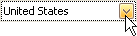

# Edit Cells in Vertical Grids
## Activate Cell Editor
Do one of the following:
* Click a cell.
* Focus a cell (for instance, via the keyboard), and press ENTER or F2.
* Focus a cell and press any alpha-numeric key. The editor will be invoked and its contents will be replaced with the pressed character.

## Select and Deselect Cell Text
Press F2 or CTRL+A.

## Close Cell Editor and Accept Changes Made
Do one of the following:
* Press ENTER.
* Click any other grid cell.
* Focus any other control.

## Discard Changes
To discard changes made in a cell, press ESC.

## Open Cell Editor's Dropdown
Do one of the following:
* Activate a cell editor and press ALT+DOWN ARROW or F4.
* Click the editor's dropdown button:
	
	

## Close Cell Editor's Dropdown
For all editors providing a dropdown, you can close the dropdown by pressing ALT+DOWN ARROW.

If the calculator is displayed in the dropdown, it can be closed via CTRL+ENTER.

Dropdowns displaying lists of items can be closed by clicking an item with the mouse, or by selecting an item with the keyboard and pressing ENTER.

## Change Values
### Change Date/Time Values

You can edit these cell values without opening the dropdown calendar. Position the caret at the portion of a date/time value that needs to be changed.  To increment the value, press CTRL+UP ARROW. To decrement the value, press CTRL+DOWN ARROW.

### Change Numeric Values

To increment the value, press CTRL+UP ARROW. To decrement the value, press CTRL+DOWN ARROW.

### Change Values of Cells That Provide Dropdown Items

To select the previous value, press CTRL+UP ARROW. To select the next value, press CTRL+DOWN ARROW.

> [!NOTE]
> This feature is not applicable to all editors.

### Edit Images

To copy, cut, paste, load and save images in image editors, right click the image and select the required command via the context menu:

