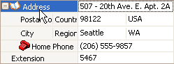
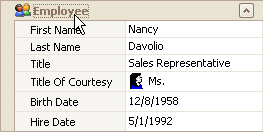
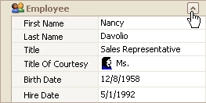

# Expand and Collapse Rows in Vertical Grids
## Expand and Collapse Data Rows
Do one of the following:
* Focus the row and then press PLUS on the keyboard to expand the row, and MINUS to collapse the row:
* Double-click the row's header.
	
	
* Click the row's expand button.
	
	

## Expand and Collapse Category Rows
Do one of the following:
* Focus the row and press PLUS on the keyboard to expand the row, and MINUS to collapse the row.
	
	
* Double-click the row.
* Click the row's expand button.
	
	

## Expand Rows Recursively
To expand a row and all its child rows that have nested rows, focus the row and press MULTIPLY on the keyboard.