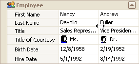
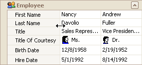

# Resize Rows and Columns in Vertical Grids
## Resize Rows
To resize a row, drag the row header's bottom edge vertically.

## Resize Columns
To resize data columns, drag a separator between data columns horizontally.

To resize the header column, do one of the following.
* Drag the header column's right edge.
	
	
* Press CTRL+LEFT ARROW to decrease the header column's width. Press CTRL+RIGHT ARROW to increase the header column's width.
* To resize headers to the minimum width while making sure all content is visible, double-click a header's right edge.