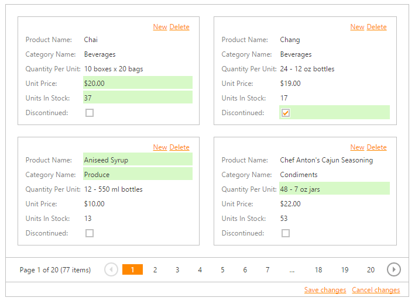

# Batch Editing
You can create new cards, delete existing cards, and edit individual cell values on a single page and save these changes with one click. 
* To create a new card, click the **New** button and specify field values.
* To delete a card, click the **Delete** button in the card to be deleted.
* To edit a cell value, click (or double-click) the cell and edit the value.

The modified cells are highlighted in a different color. To save all changes, click **Save changes** or click **Cancel changes**  to discard all the changes.

If a Card View contains unsaved data, a confirmation message is displayed before the data is lost (e.g., when sorting the data, changing the page or closing the web page). You can choose whether to proceed and lose changes or cancel the action.

