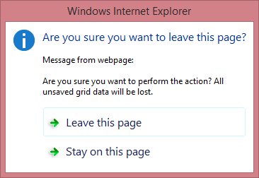

# Batch Editing
The **Card View** allows you to edit a group of records (on a single page) and save these changes with one click. In this view, you can create new cards, delete existing cards and edit individual cell values.
* To create a new card, click the **New** button and specify the field values.
* To delete a card, click the **Delete** button in the card to be deleted.
* To edit a cell value, click (or double-click) the cell and edit the value.

The cells that were modified are highlighted in a different color. To save all changes, click the **Save changes** button. To cancel all changes, click the **Cancel changes** button.

If a **Card View** contains unsaved data, a confirmation message is displayed before the data is lost (e.g., when sorting the data, changing the page or closing the web page). You can choose whether to proceed and lose changes or cancel the action.

