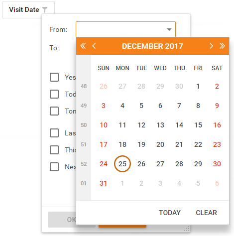
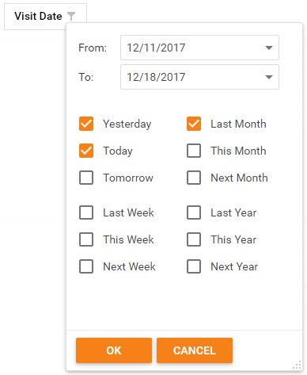
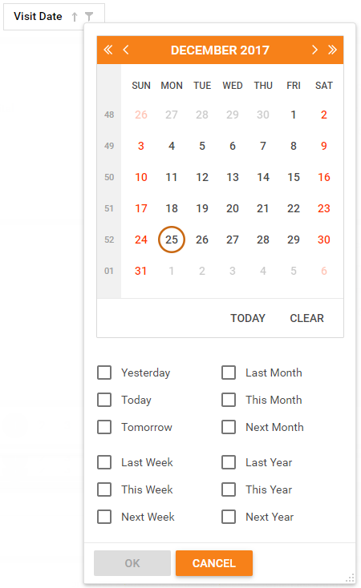

# Date Range Header Filter
The drop-down box displays a date range editor for columns containing date and time data.

## Date Range Picker
Click a filter button to invoke a filter drop-down box that contains a date picker and a set of date range periods.

Click the drop-down button in the **From** text box to display a calendar. You can select the first date in a date range or type the date in the text box.

Click the drop-down button in the **To** text box to display a calendar. You can select the last date in a date range or type the date in the text box.

Select the required date periods and click **OK** to apply the filter criteria.

## Date Range Calendar
Click a filter button to invoke a filter drop-down box that contains a calendar and a set of predefined periods.

Select the required date(s) in the calendar and date periods and click **OK** to apply the filter criteria.
