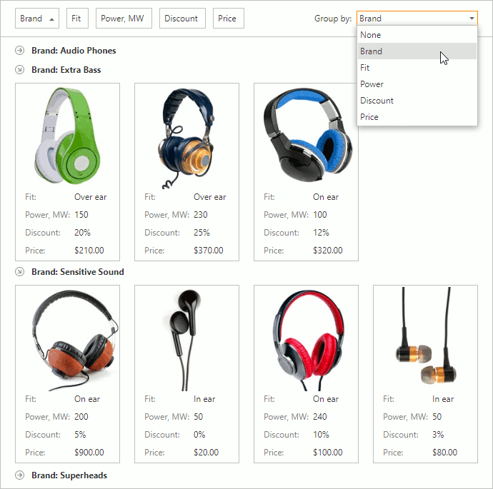

# Grouping
Enter the name of a data column	in the **Group by** box to group and sort cards by this column.

You can enter the **None** value to ungroup cards.

    

## Expand and Collapse Group Rows
Click a group row's expand button to expand or collapse the row. 

