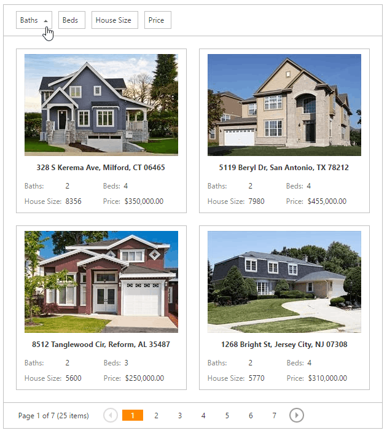

# Sorting
* To sort data, click a column header. If sorting against this column hasn't been applied, the header click will apply sorting in ascending order. If sorting has already been applied, subsequent clicks reverse the current sort order.
	
	
* A click on a column header clears the sort settings on any other columns. To sort against multiple columns, hold the SHIFT key down while clicking.
* To clear a column's sorting, click its header while pressing the CTRL key.