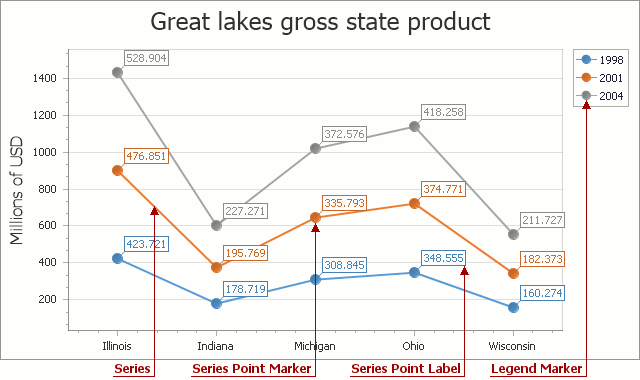

# Series Selection
If you are working with 2D charts, you can select different series or chart elements using the mouse or different gestures on your touchscreen device.

To select a particular chart element, tap it on a device supporting touchscreen or click this element using the left mouse button. The following image demonstrates how a single series is painted if it is selected using the mouse pointer.

Chart elements, which can be selected, are shown in the following illustration.

