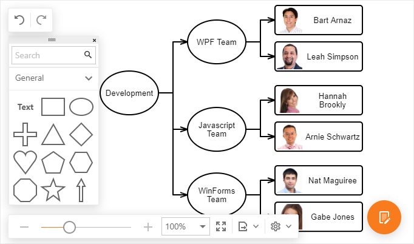

# Diagram

The **Diagram** allows you to design diagrams, flowcharts, and org charts online. 

* [First Look at the Diagram](diagram/first-look-at-the-diagram.md)
* [Create a New Chart](diagram/create-a-new-chart.md)
* [Select Elements](diagram/select-elements.md)
* [Work with Chart Elements](diagram/work-with-chart-elements.md)
* [Chart Layout](diagram/chart-layout.md)
* [Page Settings](diagram/page-and-view-settings.md)
* [Export to an Image](diagram/export-to-an-image.md)
* [Keyboard Shortcuts](diagram/keyboard-shortcuts.md)

> [!NOTE]
> Specific features described in this guide may differ from what you see in your application. This depends on your application vendor.