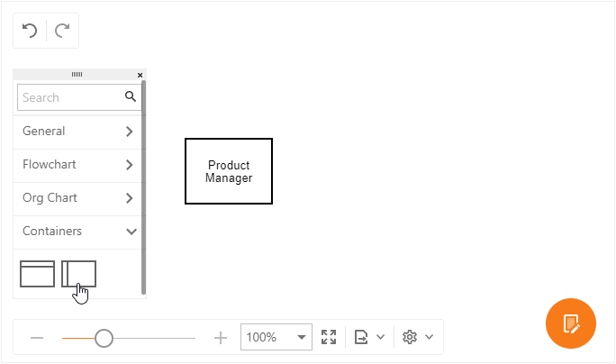
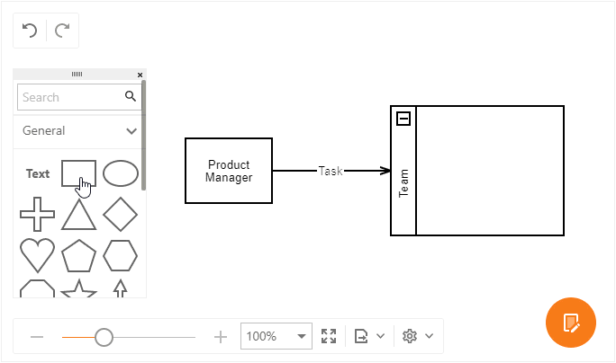
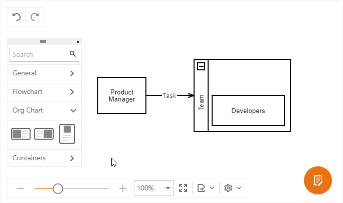

# Create a New Chart
This topic explains how to create a new chart and customize its settings.

## Add a Shape

1. Drag a shape from the **Toolbox** onto the page.

1. Double click the shape to add/edit its text.

## Connect Shapes

1. Add one more shape to the chart.

1. Hover a start shape to display its connection points. 

1. Hover a point, press the left mouse button and drag the connector to another shape's connection point. Release the mouse button. Now, if you move a shape, the connector will stretch to it.

1. Double click the connector to add a text. You can move the text along the connector by mouse.

## Place a Shape Into a Container

You can arrange shapes into collapsible horizontal and vertical containers.

Drag shape over a container, so that the container is highlighted. Drop the shape.

## Resize a Shape

1. Click a shape to select it. 

1. Drag squares at the shape borders and corners to resize the shape.

## Insert an OrgChart Shape (Shape with Image)

1. Drag a shape from the **Org Chart** toolbox group onto the page.

1. Double click the shape and change its text.

1. Right click the shape to invoke a context menu. Select the **Insert Shape Image...** command. 

1. Select the shape image in the **Insert Image** dialog box and click OK.

To change or delete the image, select the corresponding command in the context menu.

## Customize Shape and Connector Style Settings

1. Select a shape, a connector, or a group of elements.

1. Click the **Properties** button to invoke the **Properties** toolbar.

1. Customize the style settings for the selected element(s) on the **Style** tab.

