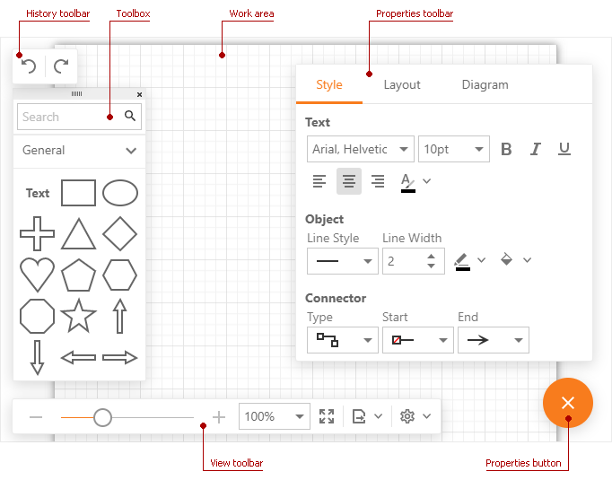
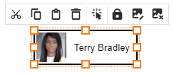

# First Look at the Diagram

## Diagram Tools

- The **History** toolbar allows you to undo and redo your actions. On mobile devises the toolbar additionally displays the **Show Toolbox** button that shows/hides the **Toolbox**.

    

- The **Toolbox** contains shapes available in the **Diagram**. Select the **View** > **Settings** > **Show Toolbox** command to switch the **Toolbox** visibility. On mobile devises the **Show Toolbox** button is additionally displayed in the **History** toolbar.

- The **Properties** toolbar allows you to [customize shape and connector style settings](create-a-new-chart.md#customize-shape-and-connector-style-settings), change the [chart layout](chart-layout.md), and specify [page settings](page-and-view-settings.md). Click the **Properties** button to show and hide the toolbar.

- The **View** toolbar contains commands related to **Diagram**'s [view settings](page-and-view-settings.md).

- The **Context Toolbox** appears when you draw a connector from a shape and release it without it being connected to another shape. Click a shape to create it at the end of the connector. Note, this toolbox can contain a reduced set of shapes. See the **Toolbox** for the full list of available shapes.

    

- The **Context Menu** appears when you right-click a chart element(s).

    

    On mobile devises tap a chart element to display the **Context Menu**. 

    

    The table below lists the menu commands.

    | Icon | Text | Description |
    |---|---|---|
    |  | Cut | Cuts the selected elements. |
    |  | Copy | Copies the selected elements to the clipboard. |
    |  | Paste | Pastes the copied elements from the clipboard. |
    |  | Delete | Deletes the selected elements. |
    |  | Select All | Select all elements in the document. |
    |  | Bring to Front | Moves the selected elements on top of other overlapping elements. |
    |  | Send to Back | Moves the selected elements behind other overlapping elements. |
    |  | Lock | Locks the selected elements. A locked element can not be moved or changed.|
    |  | Unlock | Unlock the selected elements. |
    |  | Insert Shape Image... | Shows **Insert Image** dialog. |
    |  | Change Shape Image... | Shows **Change Image** dialog.  |
    |  | Delete Shape Image | Deletes an image from the selected shape. |

## Chart Elements

- **Shape** - a base chart element. See the full list of available shapes in the **Toolbox**.
- **Connector** - a line that connects shapes.
- **Chart** - a group of shapes linked by connectors. A document can contain several unconnected charts.