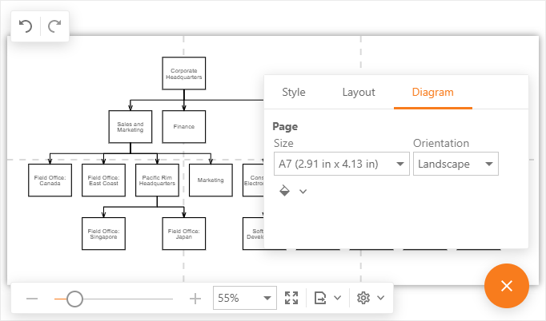
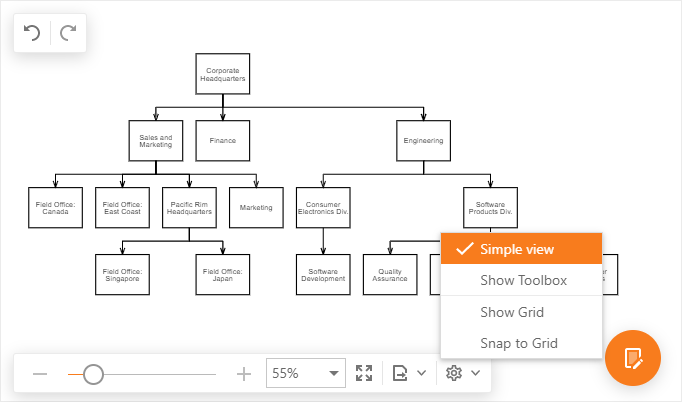
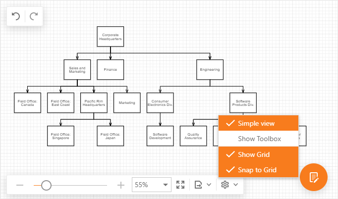
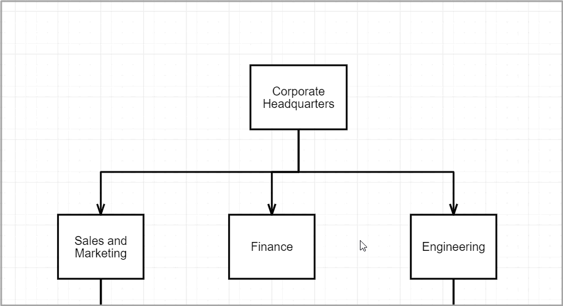

# Page and View Settings

The **Diagram** tool divides the work area into pages. Use the commands on the **Properties > Diagram** tab to specify a page's size, orientation, and color.

## Simple View
In simple view mode, the **Diagram** tool does not divide the work area into pages and a content occupies all the available work area.

To switch to simple view mode, select the **Simple View** command on the **View** toolbar.

## Grid Settings

Use the following commands on the **View** toolbar to control grid settings.

- **Show Grid** - controls the grid visibility.
- **Snap to Grid** - specifies whether shapes and connectors are snapped to the grid.

## Scroll a Page

* Spin the mouse wheel to scroll a diagram page vertically.

* Drag a side/bottom scroll bar to scroll a page vertically/horizontally.

* Hold Space and drag a diagram page to pan it in any direction.

  

## Full Screen

To switch to full screen mode, click the **Full Screen** command on the **View** toolbar or press F11 while the **Diagram** tool has focus.

## Zoom a Page

Use one of the following ways to zoom into or out of a diagram page:

* Press and hold the Ctrl key and spin the mouse wheel.

* Change the current zoom level in the **View** toolbar.
