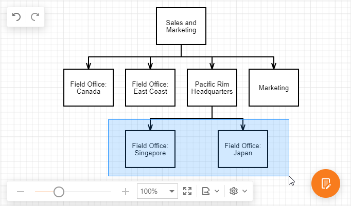

# Select Elements

- Click a shape or connector to select it.

- Click an element while holding down the Shift key to toggle the element's selected state.

## Select Multiple Elements

To select multiple elements do one of the following.

- Click elements while holding down the Shift key.
- Drag a mouse over elements while holding down the left mouse button. Elements that are inside or cross the selection area, will be selected.

## Select All

Press Ctrl+A to select all elements in the document.