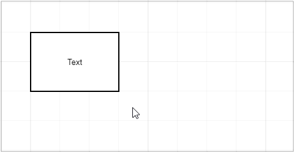
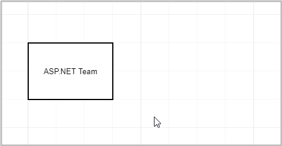
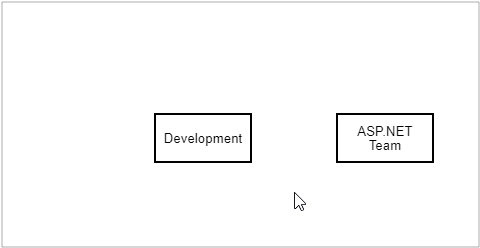

# Work with Chart Elements

## Move an Element

You can move an element or a group of [selected elements](select-elements.md) by mouse or by keyboards.

- **By mouse**: drag and drop an element. 
- **By keyboard**: select an element and press the arrow keys to move the element.

If the [Snap to Grid](page-and-view-settings.md#grid-settings) option is enabled, an element is moved snapping to grid cells. Press and hold the Ctrl key to move the element smoothly.

## Resize a Shape

1. [Select a shape](select-elements.md) to display resizing squares along the selection.

1. Drag a square to resize the shape. 

If the [Snap to Grid](page-and-view-settings.md#grid-settings) option is enabled, a shape is resized snapping to grid cells. Press and hold the Ctrl key to resize the element smoothly.

## Edit an Element's Text

1. Double click an element to start text editing.

1. Edit a text. Press the Enter key to start a new line.

1. Press the Ctrl+Enter or click outside the element to finish editing.

A connector can have several texts. A text appears at the position you double-clicked. After editing you can move the text along the connector by mouse.

## Clone an Element

You can use the mouse or keyboard commands to create a copy of an element or a group of [selected elements](select-elements.md).

- **By mouse**: press the Ctrl+Shift and drag an element to clone it.

- **By keyboard**: select an element and press the Ctrl+Shift+arrow key to create a copy next to the original element in the arrow direction.

## Link Connector to a Shape

1. Hover a shape by mouse pointer to display connection points.

1. Drag a point to create a connector.

1. Release a connector at the following positions: 

- at another shape's connection point to connect these points. In this case, the connector remains linked to the specified points if a shape is moved.

- at another shape to connect shapes without specifying particular points. In this case, if a shape is moved, the connector links to the nearest point.

Drag a shape close to a connector's end to link the shape to the connector.

