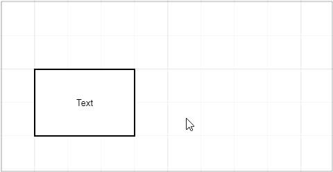
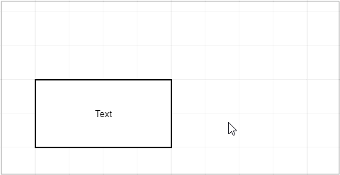
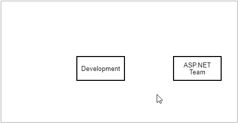
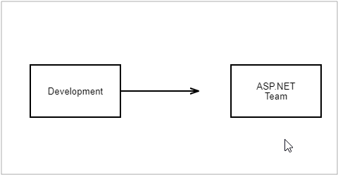
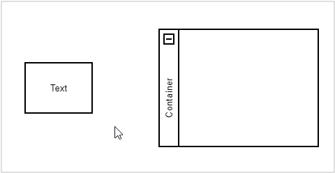

# Work with Chart Elements

## Move an Element

You can use the mouse or keyboard commands to move an element or a group of [selected elements](select-elements.md).

- **Mouse**: drag and drop an element. 
- **Keyboard**: select an element and press arrow keys to move the element.

If the [Snap to Grid](page-and-view-settings.md#grid-settings) option is enabled, an element is moved snapping to the grid. Press and hold Ctrl to move the element smoothly.

## Resize a Shape

1. [Select a shape](select-elements.md) to display resizing squares along the selection.

1. Drag a square to resize the shape. 

If the [Snap to Grid](page-and-view-settings.md#grid-settings) option is enabled, a shape is resized snapping to the grid. Press and hold Ctrl to resize the element smoothly.

## Transform a Shape

Certain shapes display a transform handle when selected. Use this handle to transform the shape.

## Edit an Element's Text

1. Double click an element to start text editing.

1. Edit the text. Press Enter to start a new line.

1. Press Ctrl+Enter or click outside the element to finish editing.

A connector can have several texts. A text box appears at the double-clicked position. After editing, you can use the mouse to move the text along the connector.

## Clone an Element

You can use the mouse or keyboard commands to create a copy of an element or a group of [selected elements](select-elements.md).

- **Mouse**: press Ctrl+Shift and drag an element to clone it.

- **Keyboard**: select an element and press Ctrl+Shift+arrow to create a copy next to the original element in the arrow's direction.

## Link a Connector to a Shape

1. Hover the mouse pointer over a shape to display its connection points.

1. Drag a point to create a connector.

1. Release a connector at one of the following positions: 

- at another shape's connection point to connect these points. In this case, the connector remains linked to the specified points if a shape is moved.

- at another shape to connect shapes without specifying particular points. In this case, the connector links to the nearest points if a shape is moved.

Drag a shape close to a connector's end to link the shape to the connector.

## Create a Shape via the Context Toolbox

The **Context Toolbox** appears when you drag a connector from a shape and drop it without connecting it to another shape. 

Select a shape to insert it at the end of the connector. 

The **Context Toolbox** allows you to create a shape inside a container. 

1. Drag a connector from a shape while pressing Ctrl and release the connector inside a container. 
2. Select the shape you want to add. The shape is placed in the container's nested shape collection.

## Modify a Connector

The **Diagram** tool can draw orthogonal and straight connectors. 

Specify a connector's line type in the **Style** tab on the **Properties** toolbar.

### Orthogonal Connectors

You can move a connector's line segments.

1. Select a connector to display its key points.
2. Drag a point to move a line segment.

### Straight Connectors

You can add line segments to connectors.

1. Select a connector to display its key points.
2. Drag a middle point to add a line segment.

To remove a key point, move it between neighboring points.

