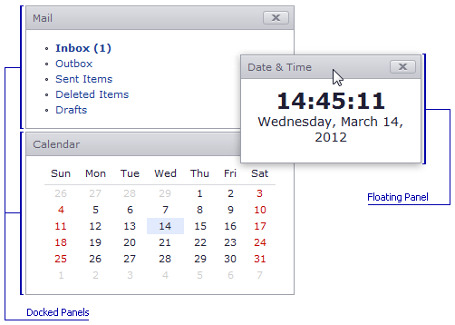
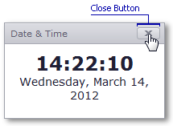

# Docking Panel
The panel can be docked to the dock zone or can be floated. To switch panel state to docked or back to float mode, double-click the panel's header.

To change the dock panel position, capture it's header, drag it and drop to the required place.

To close the dock panel, click the **Close** button.

