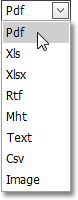
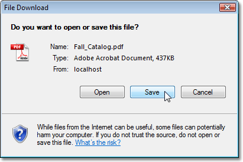

# Export a Report and Save It to the Disk
To export a document, first choose the required format for export from the list on the report toolbar. The available formats are PDF, XLS, XLSX, RTF, MHT, Text, Image and CSV.

Then, click the **Export a report and save it to the disk**  button on the report toolbar.

Click **Save** on the invoked web browser's **File Download** dialog.

Define a path for the exported document in the invoked **Save As** dialog, and click **Save**.