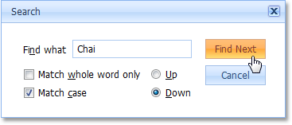

# Search for a Specific Text within a Report
To locate specific text within a report, click the **Display the search window**  button on the toolbar. This will activate the Search dialog.

To initiate a search, enter the text you wish to locate, specify additional search options (such as case matching, whole word matching, and search direction), then press the **Find Next** button.

> If you use a web browser other than the Microsoft&#174; Internet Explorer, the **Match whole word only** option is not available, and the corresponding checkbox is disabled in the **Search** dialog.