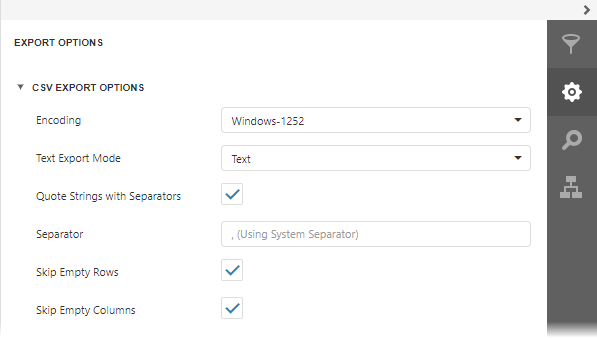

# CSV Export Options
Before [exporting a document](export-a-document.md) to CSV format, you can specify CSV-specific options in the **Export Options** panel.

* **Encoding**
	
	Specifies the encoding of the text-based file to which a report is exported.
* **Text Export Mode**
	
	Specifies whether to use the formatting of data fields in the bound data source for cells in the exported document. If this option is set to **Text**, all data fields are exported to the CSV file as strings with the corresponding formatting embedded into those strings. If the option is set to **Value**, all formatting will be lost in the resulting document.
* **Quote Strings with Separators**
	
	Specifies whether strings with separators should be placed in quotation marks in the exported document.
* **Separator**
	
	Specifies a symbol used to separate text elements (comma by default).
* **Skip Empty Rows**
	
	Specifies whether to include empty rows into the resulting file.
* **Skip Empty Columns**
	
	Specifies whether to include empty columns into the resulting file.