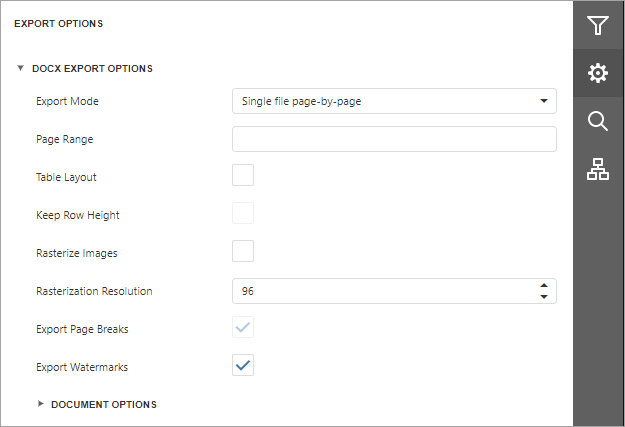

# DOCX Export Options
Before [exporting a document](export-a-document.md) to DOCX format, you can specify DOCX-specific options in the **Export Options** panel.

* **Export Mode**
	
	Specifies how a document is exported to DOCX. The following modes are available.
	* The **Single file** mode allows export of a document to a single file without dividing it into pages.
	* The **Single file page-by-page** mode allows export of a document to a single file divided into pages. In this mode, the **Page range** option is available.

* **Page Range**
	
	Specifies a range of pages which will be included in the resulting file. Use commas to separate page numbers. Use hyphens to set page ranges.

* **Table Layout**

	The table-based layout is the default layout for reports exported in **Single File** mode. You can also use the **Table Layout** option to enable this layout for reports exported in **Single File Page By Page** mode. When you export a report to **DOCX** with the table-based layout, a table with merged cells is created to mimic the original layout of the report's controls.

* **Keep Row Height**
	
	This option is enabled if you enable the **Table Layout** option. If you edit content inside the table after the export, the table cells grow to fit the new content size. Thus, the resulting document can differ from the initial document in **Print Preview**. To avoid this effect, enable the **Keep Row Height** option. If the option is set to **false** (the default value), row heights are not fixed. If you add a new line of text to a cell, the line increases the cell's row height.

* **Rasterize Images**
	
	Specifies whether to rasterize vector images, such as pictures, charts, or barcodes.

* **Rasterization Resolution**
	
	Specifies the image resolution for raster images.

* **Export Page Breaks**
	
	Specifies whether to include page breaks in the exported DOCX file.
* **Export Watermarks**
	
	Specifies whether the exported document should include watermarks (if they exist).

## Document Options
The **Document Options** complex property contains options which specify the **Document Properties** of the created DOCX file. Click the complex property's header to access its nested options.

