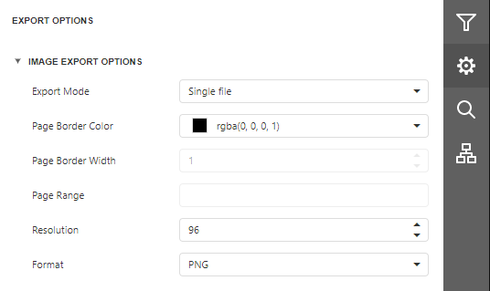

# Image Export Options
Before [exporting a document](export-a-document.md) to an image, you can specify Image-specific options in the **Export Options** panel.

* **Export Mode**
	
	Specifies how a document is exported to an image. The following modes are available.
	* The **Single File** mode allows exporting a document to a single file, without preserving the page-by-page breakdown.
	* The **Single File PageByPage** mode allows exporting a document to a single file, while preserving the page-by-page breakdown. In this mode, the **Page Border Color**, **Page Border Width** and **Page Range** options are available.
* **Page Border Color**
	
	Specifies the color of page borders.
* **Page Border Width**
	
	Specifies the width (in pixels) of page borders.
* **Page Range**
	
	Specifies a range of pages which will be included in the resulting file. To separate page numbers, use commas. To set page ranges, use hyphens.
* **Resolution**
	
	Specifies the required image resolution (in dpi).
* **Format**
	
	Specifies an image format to export a document. Available formats are BMP, GIF, JPEG, PNG, EMF, WMF and TIFF.