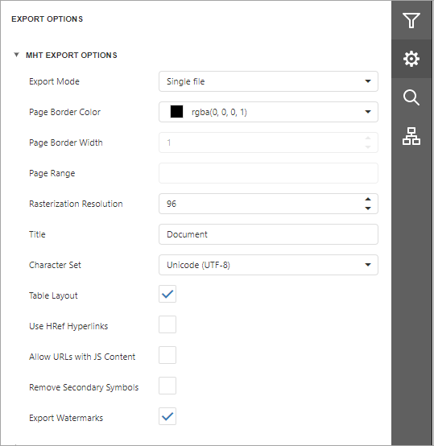

# MHT Export Options
Before [exporting a document](export-a-document.md) to MHT format, you can specify MHT-specific options in the **Export Options** panel.

* **Export Mode**
	
	Specifies how a document is exported to MHT. The following modes are available.
	* The **Single File** mode allows exporting a document to a single file, without preserving the page-by-page breakdown.
	* The **Single File PageByPage** mode allows exporting a document to a single file, while preserving the page-by-page breakdown. In this mode, the **Page Border Color**, **Page Border Width** and **Page Range** options are available.
* **Page Border Color**
	
	Specifies the color of page borders.
* **Page Border Width**
	
	Specifies the width (in pixels) of page borders.
* **Page Range**
	
	Specifies a range of pages which will be included in the resulting file. To separate page numbers, use commas. To set page ranges, use hyphens.
* **Title**
	
	Specifies a title of the created MHT file.
* **Character Set**
	
	Specifies the encoding name used in the exported document.
* **Table Layout**
	
	Specifies whether to use table or non-table layout in the resulting document.
* **Use HRef Hyperlinks**
	
	Specifies whether to enable the use of standard HTML link references in document navigation.
* **Allow URLs with JS Content**
	
	Specifies whether the JavaScript code can be placed in URLs in the resulting HTML document.
* **Remove Secondary Symbols**
	
	Specifies whether to remove all secondary symbols (for instance, **Space**, **Carriage Return**, etc.) in the resulting document to reduce its size.
* **Export Watermarks**
	
	Specifies whether to export watermarks to HTML along with the rest of the document content.