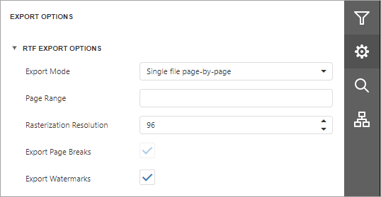

# RTF Export Options
Before [exporting a document](export-a-document.md) to RTF, you can specify RTF-specific options in the **Export Options** panel.

* **Export Mode**
	
	Specifies how a document is exported to RTF. The following modes are available.
	* The **Single File** mode allows exporting a document to a single file, without preserving the page-by-page breakdown.
	* The **Single File PageByPage** mode allows exporting a document to a single file, while preserving the page-by-page breakdown. In this mode, the **Page Range** and **Export Watermark** options are available.
* **Page Range**
	
	Specifies a range of pages which will be included in the resulting file. To separate page numbers, use commas. To set page ranges, use hyphens.
* **Rasterization Resolution**
	
	Specifies the image resolution for raster images.
* **Export Page Breaks**
	
	Specifies whether to include page breaks in the exported RTF file.

* **Export Watermarks**
	
	Specifies whether watermarks (if they exist) should be included into the resulting file.