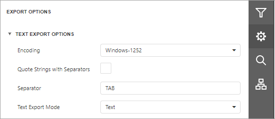

# Text Export Options
Before [exporting a document](export-a-document.md) to TXT format, you can specify TXT-specific options in the **Export Options** panel.

* **Encoding**
	
	Specifies the encoding used in the exported document.
* **Quote Strings with Separators**
	
	Specifies whether strings with separators should be placed in quotation marks in the exported document.
* **Separator**
	
	Specifies a symbol to separate text elements (TAB by default).
* **Text Export Mode**
	
	Specifies whether to use the formatting of data fields in the bound data source for cells in the exported document. If this option is set to **Text**, all data fields are exported to the text file as strings with the corresponding formatting embedded into those strings. If the option is set to **Value**, all formatting will be lost in the resulting document.