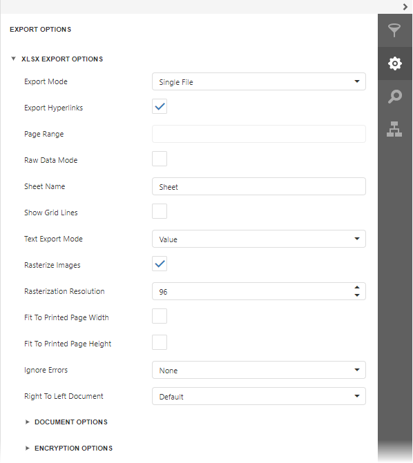

# XLSX-Specific Export Options
Before [exporting a document](export-a-document.md) to XLSX format, you can specify XLSX-specific options in the dedicated **Export Options** panel.

* **Export Mode**
	
	Specifies how a document is exported to XLSX. The following modes are available.
	* The **Single File** mode allows exporting a document to a single file, without dividing it into pages.
	* The **Single File PageByPage** mode allows exporting a document to a single file, while preserving the page-by-page breakdown. In this mode, the **Page Range** option is available.
* **Export Hyperlinks**
	
	Specifies whether to include hyperlinks into the resulting file.
* **Page Range**
	
	Specifies a range of pages which will be included in the resulting file. To separate page numbers, use commas. To set page ranges, use hyphens.
* **Raw Data Mode**
	
	Specifies whether to enable the raw data export mode. In this mode, only a document's actual data is exported to XLSX, ignoring non-relevant elements, such as images, graphic content, font and appearance settings.
* **Sheet Name**
	
	Specifies the name of the sheet in the created XLSX file.
* **Show Grid Lines**
	
	Specifies whether grid lines should be visible in the resulting XLSX file.
* **Text Export Mode**
	
	Specifies whether value formatting should be converted to the native XLSX format string (if it is possible), or embedded into cell values as plain text.