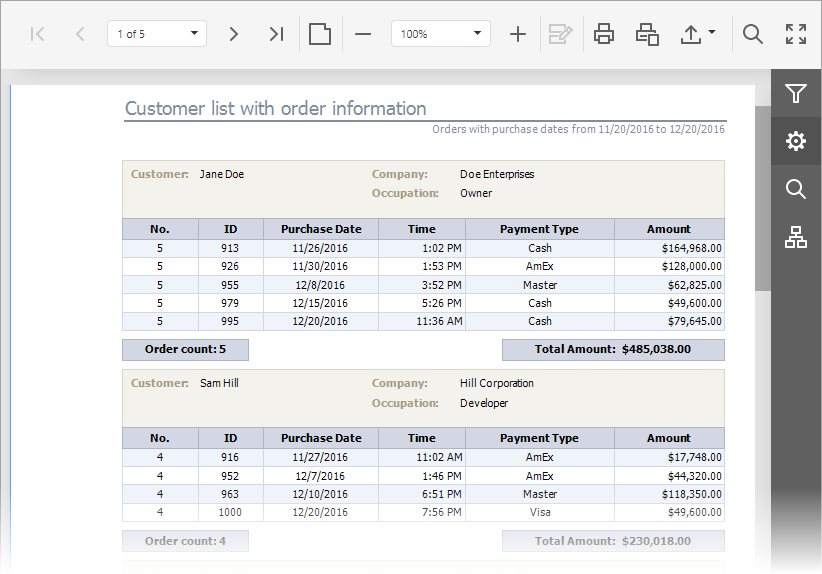

# HTML5 Document Viewer
The documents in this section provide information on the capabilities of the **Web Document Viewer**, which is based on the HTML5/JS technology and is used to display an interactive document preview on web pages.

This Viewer provides a toolbar that contains commands related to document viewing, navigating, exporting and printing. It also provides the **Document Map** for navigating throughout a document using bookmarks, the **Parameters** panel for editing report parameters, the **Export Options** panel for viewing and editing format-specific options, and the **Search** panel for locating required data.

&nbsp;

**Viewing and Navigating**
* [Navigate Between Pages](html5-document-viewer/viewing-and-navigating/navigate-between-pages.md)
* [Navigate Using Bookmarks](html5-document-viewer/viewing-and-navigating/navigate-using-bookmarks.md)
* [Search for a Specific Text](html5-document-viewer/viewing-and-navigating/search-for-a-specific-text.md)
* [Switch Display Mode](html5-document-viewer/viewing-and-navigating/switch-display-mode.md)
* [Zooming](html5-document-viewer/viewing-and-navigating/zooming.md)

&nbsp;

**Interactivity**
* [Content Editing](html5-document-viewer/content-editing.md)

&nbsp;

**Parameters**
* [Passing Parameter Values](html5-document-viewer/passing-parameter-values.md)

&nbsp;

**Printing**
* [Printing](html5-document-viewer/printing.md)

&nbsp;

**Exporting**
* [Export a  Document](html5-document-viewer/exporting/export-a-document.md)
* [CSV-Specific Export Options](html5-document-viewer/exporting/csv-specific-export-options.md)
* [HTML-Specific Export Options](html5-document-viewer/exporting/html-specific-export-options.md)
* [Image-Specific Export Options](html5-document-viewer/exporting/image-specific-export-options.md)
* [MHT-Specific Export Options](html5-document-viewer/exporting/mht-specific-export-options.md)
* [PDF-Specific Export Options](html5-document-viewer/exporting/pdf-specific-export-options.md)
* [RTF-Specific Export Options](html5-document-viewer/exporting/rtf-specific-export-options.md)
* [Text-Specific Export Options](html5-document-viewer/exporting/text-specific-export-options.md)
* [XLS-Specific Export Options](html5-document-viewer/exporting/xls-specific-export-options.md)
* [XLSX-Specific Export Options](html5-document-viewer/exporting/xlsx-specific-export-options.md)