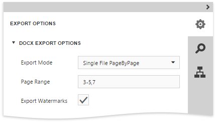

Before [exporting a document](../../../../../interface-elements-for-web/articles/document-viewer/html5-document-viewer/exporting/export-a-document.md) to DOCX format, you can specify DOCX-specific options in the dedicated **Export Options** panel.

* **Export mode**
	
	Specifies how a document is exported to DOCX. The following modes are available.
	* The **Single file** mode allows export of a document to a single file without dividing it into pages.
	* The **Single file page-by-page** mode allows export of a document to a single file divided into pages. In this mode, the **Page range** option is available.
* **Page range**
	
	Specifies a range of pages which will be included in the resulting file. Use commas to separate page numbers. Use hyphens to set page ranges.
* **Export watermarks**
	
	Specifies whether the exported document should include watermarks (if they exist).