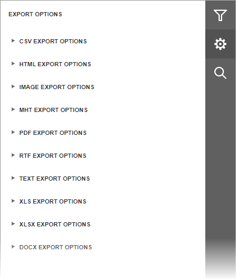

# Export a  Document
To export a document to one of the supported third-party formats, click the **Export To** button on the Document Viewer toolbar and select a required format from the invoked list. The available formats are PDF, XLS, XLSX, RTF, MHT, HTML, Text, CSV and Image.

Download of the resulting document will be initiated. Depending on your web browser's configuration, a dedicated dialog can be invoked prompting you to specify whether to only save the exported file to a disk or save the file and then open it in an appropriate application. You can also be asked to specify a path for saving the file.

In addition, the Document Viewer allows you to view and edit format-specific options required to export a document in the dedicated **Export Options** panel. To switch to this panel, click the **Export Options**  button on the right side of the Document Viewer.

The options are allocated in groups by the export format to which they are applied. You can expand the required options group by clicking on its header. Refer to the following documents to learn more about format-specific options.
* [CSV-Specific Export Options](csv-specific-export-options.md)
* [HTML-Specific Export Options](html-specific-export-options.md)
* [Image-Specific Export Options](image-specific-export-options.md)
* [MHT-Specific Export Options](mht-specific-export-options.md)
* [PDF-Specific Export Options](pdf-specific-export-options.md)
* [RTF-Specific Export Options](rtf-specific-export-options.md)
* [Text-Specific Export Options](text-specific-export-options.md)
* [XLS-Specific Export Options](xls-specific-export-options.md)
* [XLSX-Specific Export Options](xlsx-specific-export-options.md)