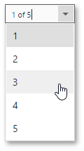

# Navigate Between Pages
To navigate to a specific page of a document, select the required page in the dedicated dropdown list on the Document Viewer's toolbar.

You can also use the     buttons on the viewer toolbar to navigate to the first, previous, next or last page, respectively.