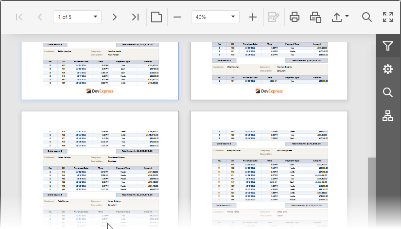

# Switch Display Mode
You can switch between the Document Viewer's display modes by clicking the **Toggle Multipage Mode**  button on the Viewer's toolbar.

In the default single page mode, document pages are displayed in the Document Viewer one at a time, thus allowing you to preserve an entire page view. You can navigate between document pages using the navigation buttons and dedicated dropdown list (see [Navigate Between Pages](navigate-between-pages.md)).

In the multipage mode, several document pages can be simultaneously displayed in the Viewer if it has sufficient space, and pages can be partially visible. In addition to the standard navigation functionality, a vertical scroll bar appears, allowing you to continuously scroll a page layout view.

