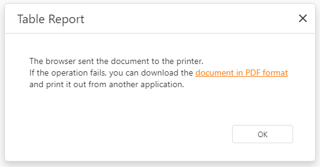

# Print
The Web Document Viewer supports pixel perfect document rendering, that is, it displays a report document exactly how it appears on paper. The Web Document Viewer renders the report in PDF and invokes the **Print** dialog of the browser PDF plug-in.

**Print**

**Print Page**

To print the entire document, click the **Print** button on the Viewer toolbar. Click the **Print Page** button to print the currently displayed document page.

When you click any of these buttons, the Document Viewer attempts to detect the browser PDF plug-in and use it for printing. 

If the PDF plug-in is installed and enabled, its **Print** dialog is invoked. To print the document, specify the settings in this dialog and click **Print**.

The Document Viewer also displays a dialog that allows you to download the PDF file in case the PDF plug-in is disabled or not installed, or print action fails. The resulting PDF file contains a script that starts printing the document immediately after it is opened in a compatible viewer.

