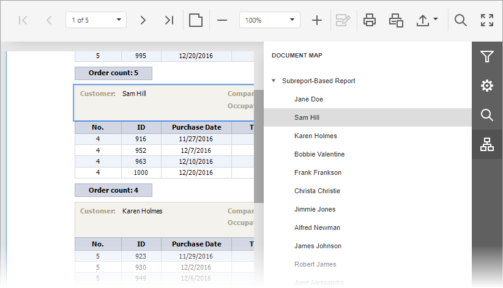

# Navigate Using Bookmarks
If a document contains bookmarks, you can use the **Document Map** panel for navigation purposes.

To switch to this panel, click the **Document Map**  button on the right side of the Document Viewer. To go to a specific bookmark, click it in the Document Map. As a result, an appropriate document page will be shown, and a document element associated with the bookmark will be highlighted.

