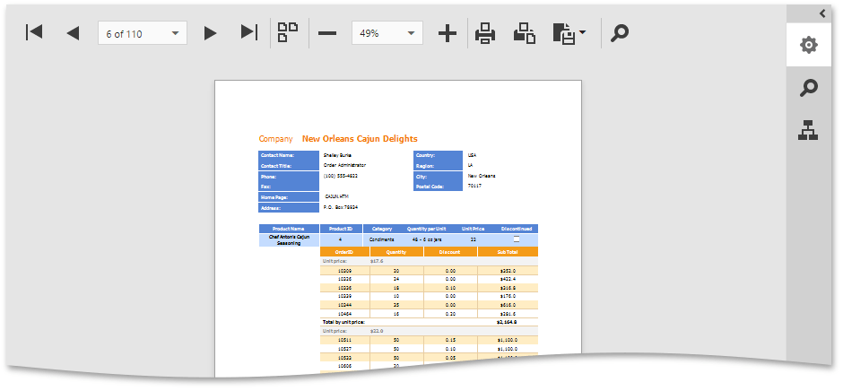
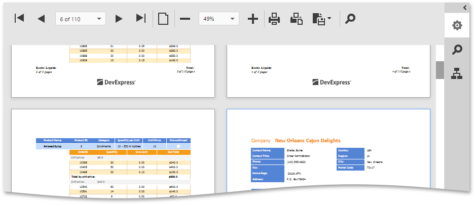

# Switch Multipage Mode
You can switch between the Single Page and MultiPage modes with the **Toggle Multipage Mode** button located in the Document Viewer toolbar.

**Toggle Multipage Mode**

In the default single page mode, the Document Viewer displays only one page. You can navigate between document pages with the navigation buttons and dropdown list (see [Navigate Between Pages](navigate-between-pages.md)).

In the multipage mode, the Document Viewer displays several document pages, the pages can be partially visible. In addition to the standard navigation features, there is a vertical scroll bar that allows you to scroll through pages.

