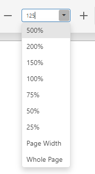

# Zoom
To zoom in or out of a document, click the **Zoom In**  or **Zoom Out** 
 button on the Document Viewer toolbar. These buttons change the current zoom factor by 5 percent.

 

 Zoom In

Zoom Out

You can enter the desired zoom factor in the combobox editor or select one of the zoom factor presets in the drop-down list.

