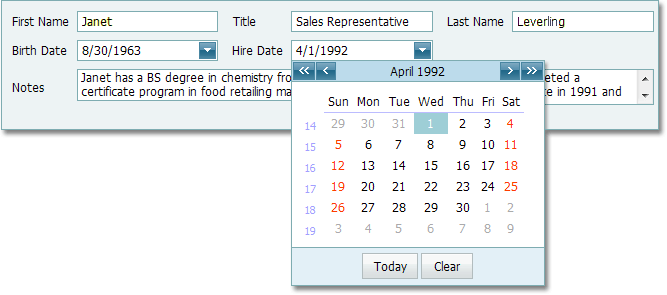

# Editors
This section describes the capabilities provided by the editor controls:

* [Work with Dropdown Editors](editors/work-with-dropdown-editors.md)
* [Editing Values, Selecting Text and Using the Clipboard](editors/editing-values-selecting-text-and-using-the-clipboard.md)
* [Editor Context Menu](editors/editor-context-menu.md)
* [Masked Input](editors/masked-input.md)
* [Calendar](editors/calendar.md)
* [Captcha](editors/captcha.md)
* [Color Edit](editors/color-edit.md)
* [Token Box](editors/token-box.md)
* [Track Bar](editors/track-bar.md)
* [Validation Summary](editors/validation-summary.md)