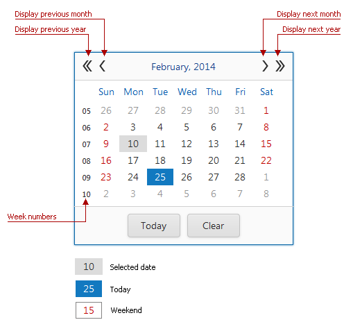

# Calendar
The **Calendar** is used to [select dates](calendar/date-selection.md), and allows you to navigate through months and years.

The header buttons in the Calendar allow you to navigate through months and years. Click the header text (i.e., the current month and year) to display the [Fast Navigation Window](calendar/fast-navigation-window.md).

## Keyboard Support
| Key Combination | Action (when no date is selected) | Action (when a date is selected) |
|---|---|---|
| LEFT ARROW | Selects the current day | Moves selection to the previous day |
| RIGHT ARROW | Selects the current day | Moves selection to the next day |
| UP ARROW | Selects the current day | Moves selection one week back |
| DOWN ARROW | Selects the current day | Moves selection one week forward |
| PAGE UP | Selects the current day | Moves selection one month back |
| PAGE DOWN | Selects the current day | Moves selection one month forward |
| END | Selects the last day of the current month | Moves selection to the last day of the month |
| HOME | Selects the first day of the current month | Moves selection to the first day of the month |
| ENTER | Applies changes | Applies changes |
| ESC | Cancels changes and closes the calendar | Cancels changes and closes the calendar |

This section consists of the following topics.
* [Fast Navigation Window](calendar/fast-navigation-window.md)
* [Date Selection](calendar/date-selection.md)